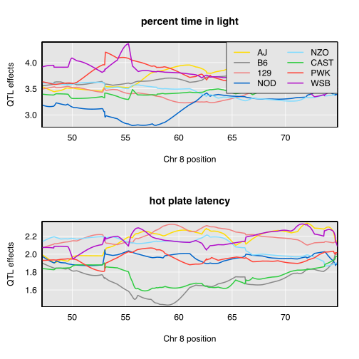

```{r setup, include=FALSE}
options(htmltools.dir.version = FALSE)
library(knitr)
ratio <- "4:3"
fig_height <- ifelse(ratio=='4:3', 10, 7.5)
fig_width <- 15
curves_height <- ifelse(ratio=='4:3', 580, 540)
curves_width <- ifelse(ratio=='4:3', 800, 1080)
knitr::opts_chunk$set(#dev="svg", 
                      echo=FALSE, 
                      #results="hide",
                      #fig.height=fig_height,
                      #fig.width=fig_width,
                      warning=FALSE, message=FALSE)
xaringan::summon_remark() # download latest version, locally
```


```{r load_refs, echo=FALSE, cache=FALSE}
library(RefManageR)
BibOptions(check.entries = FALSE, 
           bib.style = "authoryear", 
           cite.style = 'authoryear', 
           style = "markdown",
           hyperlink = FALSE, 
           dashed = FALSE, 
           longnamesfirst = FALSE,
           max.names = 2,
           bibpunct = c(" (", ") ", ",", ",", " and ", " "))
myBib <- ReadBib("./research.bib", check = FALSE)
```


```{r xaringan-themer, include = FALSE}
library(xaringanthemer)
#mono_light(
#  base_color = "#1c5253",
#  header_font_google = google_font("Josefin Sans"),
#  text_font_google   = google_font("Montserrat", "300", #"300i"),
#  code_font_google   = google_font("Droid Mono")
#)
solarized_light()
```


# Introduction

- 10,000+ traits with RNA sequencing and mass spectrometry 

- Multiparental populations offer high-resolution QTL mapping

- New analysis tools, such as a pleiotropy test for multiparental populations, are needed 


???

- Together, high-dimensional traits and multiparental populations can inform complex trait genetics

---

# `r Citet(myBib, "jiang1995multiple")` test

- Two-parent crosses    

- Applies to two traits that co-map     

- $H_0$: Pleiotropy    

- $H_A$: Two separate QTL    


---

# `r Citet(myBib, "jiang1995multiple")` test


- Perform a two-dimensional two-QTL scan     

- $vec(Y) = Xvec(B) + vec(E)$     

- Calculate likelihood ratio test statistic     

???

- Y: 2 traits  
- X: genotype probs for 2 markers  
- B: founder allele effects  
- E: random errors  
- vec: stack columns

- 2d scan involves all ordered pairs of markers


---

# `r Citet(myBib, "jiang1995multiple")` test

```{r pkgs}
library(tidyverse)
library(ggalt) #contains geom_encircle
```

```{r encircle}
# two-dimensional grid for pleiotropy testing
c1 <- c(rep(1:5, each = 5), 1:5)
c2 <- c(rep(1:5, times = 5), 1:5)
foo <- c(rep(2, 25), rep(1, 5))

tibble(c1, c2, foo = as.factor(foo)) %>%
  ggplot() + geom_encircle(aes(x = c1, 
                               y = c2, 
                               color = foo, 
                               #fill = foo, 
                               #alpha = 0.1
                               ), 
                           s_shape = 0, spread = 0.01, expand = 0.05
                           ) + 
  geom_point(aes(x = c1, y = c2, color = foo)) + 
  xlim(c(0, 6)) + ylim(c(0, 6)) + xlab("trait1 position") + 
  ylab("trait2 position") + 
  theme(legend.position = "none") + 
  theme(axis.text.x = element_text(face="bold",  
                           size=14),
          axis.text.y = element_text(face="bold",
                           size=14), 
        axis.title = element_text(face = "bold", size = 16)
        )


```

???

Fit bivariate model & calculate likelihood at each grid point.


---

# Multiparental populations

```{r mppfig, echo = FALSE, out.width = "700px", fig.height=fig_height, fig.width = fig_width}
source("R/hs_fig.R")
# https://github.com/kbroman/Talk_JAX2018/blob/master/R/hs_fig.R
```


???


- start with 8 inbred founder lines  
- inbred lines are color-coded  
- each subject represented by one homologous chromosome pair  
- over successive generations of outbreeding, subjects have smaller and smaller contiguous regions from a single inbred line  


---

# Challenges in multiparental populations

- Complex patterns of relatedness    

- Multiple founder lines


???

Two challenges occur at the point of relating phenotypes to genotypes


---

# Challenges in multiparental populations

- Complex patterns of relatedness    

.soln[Multivariate random effects]

- Multiple founder lines

.soln[Fixed effect for each founder allele]    


---

# Test procedure

- Model: $$vec(Y) = Xvec(B) + vec(G) + vec(E)$$ 
    
- Calculate likelihoods at every grid point

???

- $G$: Polygenic random effects that depend on the kinship matrix  
    
- $E$: Random errors
  
  


---

# Test procedure

- Test statistic: $$- \log \frac{\max (\text{likelihood under pleiotropy})}{\max (\text{likelihood for separate QTL})}$$    

- Parametric bootstrap to get a p-value    


???

We fit the bivariate QTL models at all points on the two-dimensional grid. With the likelihoods of those model fits, we calculate a likelihood ratio test statistic.

Approximate the null distribution with the distribution of bootstrap test statistics

---

# Application

- `r Citet(myBib, c("logan2013high", "recla2014precise"), .opts = list(max.names = 1))` studied 261 Diversity Outbred mice    

- Measured about two dozen behavioral traits

???

We applied our test to freely available data from the Chesler laboratory.


---

# Application

- Two traits map to Chr 8:

    - "hot plate latency" (57 cM)    

    - "percent time in light" (55 cM)

???

Do they share a single QTL? 

We examined these two traits because they map to the same region

Hot plate latency is a measure of thermal pain sensitivity

Percent time in light is related to measures of anxiety

---

# QTL scan results

```{r chr8lod, out.height="500px"}

```

???

- X axis is Chromosome 8 position
- Y axis is LOD, a measure of evidence for presence of QTL. High LOD scores correspond to strong evidence of a QTL

Zooming in on Chr 8, we see that "percent time in light" has a broad peak from 53 cM to 60 cM

"hot plate latency" has an even broader peak, from about 55cM to 65 cM

"hot plate latency" reaches LOD score of ~6, while "precent time in light" achieves a maximum LOD just over 5


---

# Allele effects plots  


```{r effects, echo = FALSE, out.width = "500px"}

```

???

- X axis is Chr 8 position
- Y axis is allele effect (on the trait)
- 8 lines per figure: one for each founder line


- Distinct allele effects patterns suggest separate QTL


---

# Profile LOD

$$\text{profile LOD}_{\text{trait 1}}(\lambda_1) = max_{\lambda_2}LOD(\lambda_1, \lambda_2)$$


```{r profile-trace, out.width=400}
c1 <- rep(1:5, each = 5)
c2 <- rep(1:5, times = 5)
c3 <- 2
tibble(c1, c2) %>%
  ggplot() + geom_encircle(aes(x = c3, 
                               y = c2
                               ), 
                           s_shape = 0, spread = 0.01, expand = 0.05
                           ) + 
  geom_point(aes(x = c1, y = c2)) + 
  xlim(c(0, 6)) + ylim(c(0, 6)) + xlab("trait1 position") + 
  ylab("trait2 position") + 
  theme(legend.position = "none") + 
  theme(axis.text.x = element_text(face="bold",  
                           size=14),
          axis.text.y = element_text(face="bold",
                           size=14), 
        axis.title = element_text(face = "bold", size = 16)
        )
```

???

- Same two-dimensional grid, with trait 1 position along X axis and trait 2 position on Y axis.    
- To calculate profile LOD at a given position for trait 1 (labeled by $\lambda_1 = 2$), I consider the five LOD values that have $\lambda_1 = 2$ and choose the maximum of the five LOD values.


---

# Profile LOD

```{r profiles, echo = FALSE}
include_graphics("figs/profile.svg", auto_pdf = FALSE)
```

???

The x axis is Chr 8 position

The y axis is LOD

There are three "traces": one for each trait and one for the pleiotropy hypothesis.

The pleiotropy trace derives from the likelihoods for the pleiotropy models (ie, the diagonal on the grid)

The "hot plate latency" profile LOD trace reveals a broad peak from 55 to 65 cM

The "percent time in light" profile LOD trace displays a sharp peak atop a broad region with higher LOD scores. 

The triangles correspond to the univariate QTL peak positions, while the circles are the profile LOD peak positions.

The two profile LOD traces achieve the same maximum value, which is the test statistic value. 


---

# Test results


- $\Lambda = 1.2$

- $p = 0.11$ (1000 bootstrap samples)


---

# Conclusions

- Weak evidence for two separate QTL

    - One QTL affects "distance traveled in light"    
    
    - Second QTL affects "hot plate latency"


---

# Contact information

- frederick.boehm@gmail.com   

- https://fboehm.us/     

- qtl2pleio R package: [https://github.com/fboehm/qtl2pleio](https://github.com/fboehm/qtl2pleio)

- Biorxiv pre-print: [http://bit.ly/boehm-biorxiv](http://bit.ly/boehm-biorxiv)


---

# References

```{r bib, results = 'asis'}
PrintBibliography(myBib, .opts = list(style = "markdown"), start = 1, end = 3)
```

---

# References

```{r bib2, results = 'asis'}
PrintBibliography(myBib, .opts = list(style = "markdown"), start = 4, end = 6)
```

