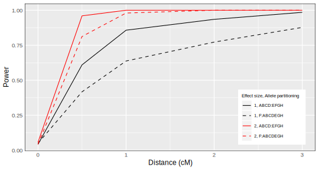

# Quantitative Trait Locus (QTL) Mapping {.center} 

::: {.cell}

:::

::: {.cell}

:::

## Motivation

- Variations in quantitative traits are due to genetic and environmental factors  
- Quantitative trait loci: number, locations, effects, identities  
- Biological insights: new drugs, improve breeding, natural selection

::: {.notes}

- Knowledge of the number, locations, effects, and identities of these factors can contribute to new biological insights  
    - new drugs  
    - improve breeding in agriculture  
    - better understanding of natural selection   

:::

---

## What is QTL mapping?

- A statistical method to identify genetic factors, or loci, that affect a quantitative trait  
- Consider each marker, one at a time, and test whether it affects the trait  

---

## QTL mapping in two-parent crosses

::: {.cell}
::: {.cell-output-display}
{width=960}
:::
:::

::: {.notes}

- Cross two inbred lines to produce a F1 population  
- Cross F1 subjects to produce a F2 population    
- Genotype F2 subjects at many markers  
- Phenotype F2 subjects for the trait of interest  
- Test each marker for association with the trait  

:::

# QTL Mapping in Multiparental Populations

## Multiparental populations

::: {.cell}
::: {.cell-output-display}
{width=700px}
:::
:::

::: {.notes}

- start with 8 inbred founder lines  
- inbred lines are color-coded  
- each subject represented by one homologous chromosome pair  
- over successive generations of outbreeding, subjects have smaller and smaller contiguous regions from a single inbred line  
:::

---

## Motivation

- 10,000+ traits with RNA sequencing and mass spectrometry 

- Multiparental populations offer high-resolution QTL mapping

- New analysis tools, such as a pleiotropy test for multiparental populations, are needed 

{.absolute bottom=30 left=450 width="300" height="250"}

::: {.notes}

- Together, high-dimensional traits and multiparental populations can advance complex trait genetics

:::

# A New Pleiotropy Test

## Benefits of a new pleiotropy test

- Insights into genetic architecture

- Tool for expression trait hotspot dissection

- Complements mediation analysis

::: {.notes}

When trying to identify an intermediate, a pleiotropy test limits the number of mediation analyses by identifying traits that share a QTL

:::

---

## @jiang1995multiple test

- Two-parent crosses    

- Applies to two traits that co-map     

- $H_0$: Pleiotropy    

- $H_A$: Two separate QTL    

---

## @jiang1995multiple test 

- Perform a two-dimensional two-QTL scan     

- $vec(Y) = Xvec(B) + vec(E)$     
    
 

::: {.cell}
::: {.cell-output-display}
{width=384}
:::
:::

::: {.notes}

- Y: n by 2 matrix for 2 traits  
- X: 2n by 2 block diagonal matrix genotype probabilities for 2 markers  
- B: founder allele effects  
- E: random errors, iid within each phenotype  
- vec: stack columns

- 2d scan involves all ordered pairs of markers

- Calculate likelihood at each ordered pair of positions    

- Calculate likelihood ratio test statistic     

:::

---

## Challenges in multiparental populations

- Complex patterns of relatedness    

::: {.soln}
Multivariate random effects
:::

- Multiple founder lines

::: {.soln}
Fixed effect for each founder allele
:::

::: {.notes}

Two challenges occur at the point of relating phenotypes to genotypes
:::

---

## Test procedure

- Perform a two-dimensional two-QTL scan     

- $vec(Y) = Xvec(B) + vec(G) + vec(E)$     
    

::: {.cell}
::: {.cell-output-display}
{width=384}
:::
:::

::: {.notes}

- $G$: Polygenic random effects that depend on the kinship matrix  
    
- $E$: Random errors

- Calculate likelihood at each ordered pair of positions    

- Calculate likelihood ratio test statistic     

:::  

---

## Test procedure

- Test statistic: $$- \log_{10} \frac{\max (\text{likelihood under pleiotropy})}{\max (\text{likelihood for separate QTL})}$$    

- Parametric bootstrap to get a $p$-value    

::: {.notes}

We fit the bivariate QTL models at all points on the two-dimensional grid. With the likelihoods of those model fits, we calculate a likelihood ratio test statistic.

Approximate the null distribution with the distribution of bootstrap test statistics

:::

# Chesler Laboratory Data Application

## @logan2013high & @recla2014precise

- 261 Diversity Outbred mice    

- Measured about two dozen behavioral traits

{.absolute bottom=30 left=50 width="350" height="300"}

{.absolute bottom=30 right=50 width="350" height="300"}

::: {.notes}

- Two traits map to Chr 8:

    - "hot plate latency" (57 cM)    

    - "percent time in light" (55 cM)

We applied our test to freely available data from the Chesler laboratory.

Do the two traits share a single QTL? 

We examined these two traits because they map to the same region

Hot plate latency is a measure of thermal pain sensitivity

Percent time in light is related to measures of anxiety

:::

---

## Data Structures

- $261$ subjects by $8$ founder lines matrix per marker  

- Allele dosages for 8 founder lines per subject per marker  
 
- $261$ subjects by $261$ subjects (LOCO) kinship matrix (per chromosome)

- $261$ subjects by $2$ traits matrix

::: {.notes}

- Each chromosome's genetics data is a separate array, with one matrix per marker

:::

---

## Percent time in light

::: {.cell}
::: {.cell-output-display}
{width=650px}
:::
:::

::: {.notes}

- X axis is Chr 8 position
- Y axis is allele effect (on the trait)
- 8 lines per figure: one for each founder line

:::

---

## Hot plate latency

::: {.cell}
::: {.cell-output-display}
{width=650px}
:::
:::

::: {.notes}

- Distinct allele effects patterns suggest separate QTL

:::

---

## Correlation between traits

::: {.cell}
::: {.cell-output-display}

:::
:::

::: {.notes}

- Correlation coefficient estimate is $-0.15$

:::

---

## LOD definitions

- $$LOD(\lambda_1, \lambda_2) = ll_{10}(\lambda_1, \lambda_2) - \max_{\lambda} ll_{10}(\lambda, \lambda)$$

- $$\text{profile LOD}_{\text{trait 1}}(\lambda_1) = \max_{\lambda_2}LOD(\lambda_1, \lambda_2)$$

- $$LOD_p(\lambda) = ll_{10}(\lambda, \lambda) - \max_{\lambda} ll_{10}(\lambda, \lambda)$$

---

## Profile LOD

::: {.cell}
::: {.cell-output-display}
{width=650px}
:::
:::

::: {.notes}

The x axis is Chr 8 position

The y axis is LOD

There are three "traces": one for each trait and one for the pleiotropy hypothesis.

The pleiotropy trace derives from the likelihoods for the pleiotropy models (ie, the diagonal on the grid)

The "hot plate latency" profile LOD trace reveals a broad peak from 55 to 65 cM

The "percent time in light" profile LOD trace displays a sharp peak atop a broad region with higher LOD scores. 

The triangles correspond to the univariate QTL peak positions, while the circles are the profile LOD peak positions.

The two profile LOD traces achieve the same maximum value, which is the test statistic value. 

:::

---

## Test results

- $\log_{10} \Lambda = 1.2$

- $p = 0.11$ (1000 bootstrap samples)

::: {.notes}

- Weak evidence for two separate QTL

    - One QTL affects "distance traveled in light"    
    
    - Second QTL affects "hot plate latency"

:::

---

## Parametric bootstrap test

- Simulate data under the null hypothesis  
- Calculate test statistic for each simulated dataset  
- Determine proportion of simulated test statistics that exceed observed test statistic  

::: {.notes}

:::

# Simulation Studies

## Assess Type I Error Rate

::: {.cell}
::: {.cell-output-display}

:::
:::

::: {.notes}

- 2 by 2 by 2 factorial design  
- 400 trait pairs per scenario  
- 400 bootstrap samples per trait pair  

:::

---

## Assessing Power

::: {.cell}
::: {.cell-output-display}

:::
:::

::: {.notes}

- 2 by 2 by 5 factorial design  
- 3 factors: allele effects difference, allele effects partitioning, and inter-locus distance  
- Simulated 400 trait pairs per scenario
- 400 bootstrap samples per trait pair

:::

# `qtl2pleio` R package

## `qtl2pleio` R package

::: {.cell}
::: {.cell-output-display}

:::
:::

::: {.notes}

- Functions for $d$-variate, $d$-QTL scan & profile LOD plots  

- Uses C++ for matrix calculations (via Rcpp and RcppEigen)  

- Uses `gemma2` R implementation of GEMMA EM algorithm for multivariate random effects  

- Unit tests, vignettes, and version control  

- Open source development on GitHub  

- unit tests to ensure accurate calculations

- vignettes on analyzing a pair of traits & on cluster computing for bootstrap test
:::

---

## `qtl2pleio` R package 

- `qtl2pleio` R package: <https://fboehm.us/software/qtl2pleio/>

::: {.cell}
::: {.cell-output-display}

:::
:::

::: {.notes}

- Also available on CRAN  

:::

---

## Thank you!

---

## References {visibility="uncounted"}

